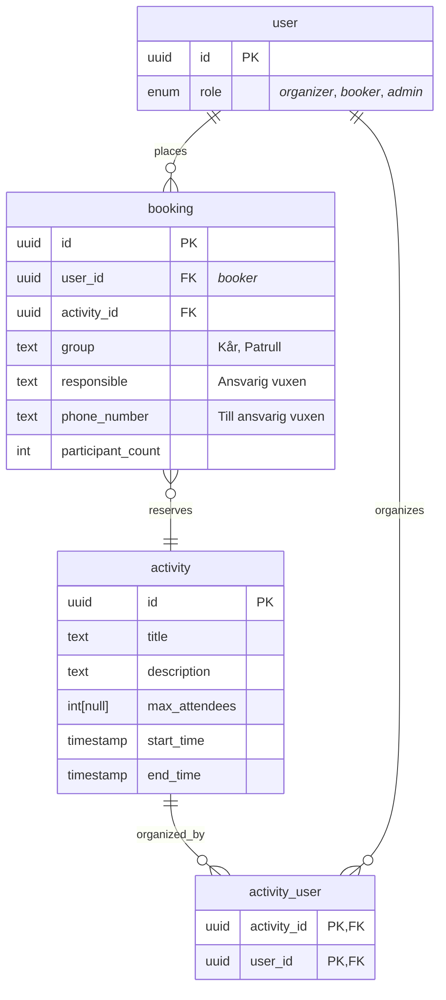
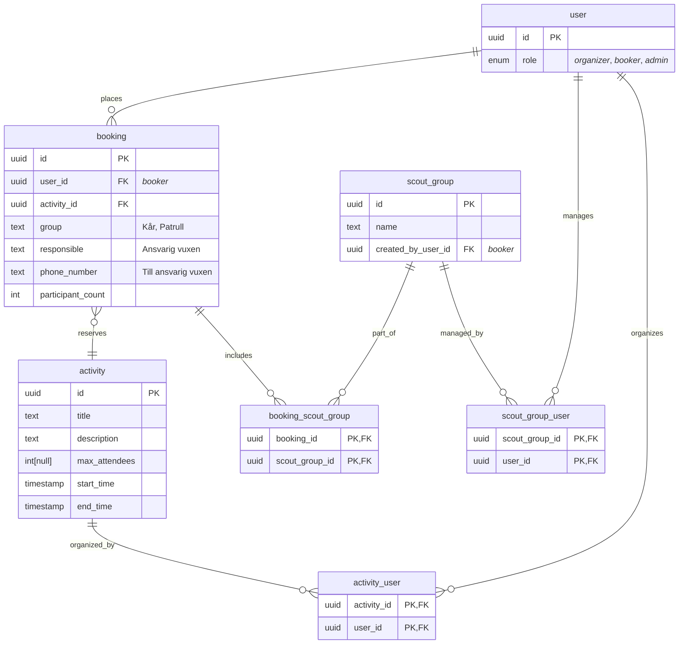

# Booking app for Jamboree26

This app will enable participant of Jamboree 2026 to book various activities.

## Tech stack

- Gleam
  - mist + wisp for web server
  - lustre + hx for templating and SSR
  - Squirrel for type safe DB interface
  - Cigogne for database migrations
- HTMX
- TailwindCSS
- PostgreSQL

## Folder structure

| Path                                         | Purpose                                                      |
| -------------------------------------------- | ------------------------------------------------------------ |
| [`src/`](src/)                               | Gleam source code                                            |
| [`src/j26booking/`](src/j26booking/)         | Main app modules (components, data, router, sql, web, etc.)  |
| [`src/j26booking/sql/`](src/j26booking/sql/) | SQL queries for Squirrel                                     |
| [`priv/migrations/`](priv/migrations/)       | Database migration SQL files (applied with Cigogne)          |
| [`priv/seeding/`](priv/seeding/)             | SQL scripts for seeding the database with example data       |
| [`priv/static/`](priv/static/)               | Static files to be served by the web server (e.g. HTML, CSS) |
| [`test/`](test/)                             | Gleam test files                                             |

## Development

### Local Development (without Docker)

```sh
gleam run   # Run the project
gleam test  # Run the tests
```

### Local Development (with Docker)

The easiest way to run the entire stack locally is using Docker Compose:

```sh
# Start all services (database + migrations + application)
docker-compose up

# Start in detached mode
docker-compose up -d

# View logs
docker-compose logs -f app

# Stop all services
docker-compose down

# Rebuild after code changes
docker-compose up --build
```

The application will be available at http://localhost:8000

**Note**: Database migrations run automatically when starting the stack. The app service waits for migrations to complete successfully before starting.

### Environment Variables

The application can be configured using the following environment variables:

| Variable | Default | Description |
|----------|---------|-------------|
| `PORT` | 8000 | Port the web server listens on |
| `DB_HOST` | localhost | PostgreSQL host |
| `DB_PORT` | 5432 | PostgreSQL port |
| `DB_NAME` | j26booking | Database name |
| `DB_USER` | postgres | Database user |
| `DB_PASSWORD` | (empty) | Database password |
| `DB_POOL_SIZE` | 15 | Connection pool size |
| `SECRET_KEY_BASE` | (random) | Secret key for sessions (required in production) |

### Building Docker Image

To build the Docker image manually:

```sh
# Build the image
docker build -t j26booking:latest .

# Run the container
docker run -p 8000:8000 \
  -e DB_HOST=host.docker.internal \
  -e SECRET_KEY_BASE=your-secret-key \
  j26booking:latest
```

## Frontend Development Guide

This guide is for frontend developers working on UI components and styling. No deep Gleam knowledge required to get started!

The whole section is generated by the Claude Code AI tool 🤖 and validated by Markus Wesslén.

### Quick Start

1. **Start the server**: Run `gleam run` in the project root
2. **View the app**: Open http://localhost:8000 in your browser
3. **Make changes**: Edit files and refresh the browser to see updates
4. **Format code**: Always run `gleam format` before committing

### Project Structure for Frontend

```
priv/static/          → Static files (HTML, CSS, JS) served directly by the web server
├── index.html        → Landing page (example of pure static HTML)
├── styles.css        → Your CSS files (TailwindCSS recommended)
└── *.js              → Optional JavaScript files

src/j26booking/components.gleam → Lustre components for server-side rendering
                                  (generates HTML dynamically from database)
```

### Two Approaches to Frontend

#### 1. Static Files (Simple Pages)

For landing pages, static content, or pages that don't need database data:

**Example**: `priv/static/about.html`
```html
<!DOCTYPE html>
<html>
<head>
    <meta charset="UTF-8">
    <title>About Us</title>
    <link rel="stylesheet" href="/styles.css">
    <script src="https://cdn.jsdelivr.net/npm/htmx.org@2.0.6/dist/htmx.min.js"></script>
</head>
<body>
    <h1>About Jamboree 2026</h1>
    <p>Welcome to our booking system!</p>
</body>
</html>
```

- Files in `priv/static/` are automatically served at `http://localhost:8000/<filename>`
- Use this for: landing page, help/FAQ pages, static assets (CSS, JS, images)

#### 2. Lustre Components (Dynamic Pages)

For pages that display database data or need server-side logic:

**Example**: See `src/j26booking/components.gleam` for `activities_page` and `activities_list`

- Components are written in Gleam but generate HTML
- Use this for: activity lists, booking forms, user dashboards
- Components can be full pages or fragments for HTMX

### Working with Lustre Components

You don't need to be a Gleam expert! Here's the basic pattern:

#### Component Structure

```gleam
import lustre/element
import lustre/element/html
import lustre/attribute

pub fn my_component(title: String, items: List(String)) {
  html.div([], [
    html.h2([], [element.text(title)]),
    html.ul(
      [attribute.class("my-list")],
      list.map(items, fn(item) {
        html.li([], [element.text(item)])
      })
    ),
  ])
}
```

**Key concepts**:
- `html.div(attributes, children)` creates HTML elements
- `attribute.class("...")` adds CSS classes
- `element.text("...")` creates text nodes
- `list.map(items, fn(item) { ... })` loops over lists

#### Adding a New Component

1. Open `src/j26booking/components.gleam`
2. Add your function (see examples above)
3. Use HTML-like Lustre functions: `html.div`, `html.button`, `html.form`, etc.
4. Run `gleam format` to auto-format your code

**Example - Adding a booking form component**:

```gleam
pub fn booking_form(activity_name: String) {
  html.form(
    [
      attribute.method("post"),
      attribute.action("/book"),
    ],
    [
      html.h3([], [element.text("Book: " <> activity_name)]),
      html.input([
        attribute.type_("text"),
        attribute.name("group"),
        attribute.placeholder("Kår/Patrull namn"),
      ]),
      html.button([attribute.type_("submit")], [
        element.text("Boka aktivitet"),
      ]),
    ],
  )
}
```

3. To use it in a route, ask a backend developer to add it to `router.gleam`

### HTMX Integration

HTMX lets you build dynamic UIs without writing JavaScript. Key patterns used in this project:

#### Pattern 1: HTMX Fragments (Partial Updates)

The activities page uses this pattern (see `components.gleam:29-61`):

```gleam
// Full page component
pub fn activities_page(activity_names: List(String), search_query: String) {
  html.html([], [
    html.head([], [/* ... */]),
    html.body([], [
      html.input([
        hx.get("/activities"),  // Fetches from this endpoint
        attribute.attribute("hx-trigger", "keyup changed delay:300ms"),
        attribute.attribute("hx-target", "#activities-list"),  // Updates this div
      ]),
      html.div([attribute.id("activities-list")], [
        activities_list(activity_names),  // Initial content
      ]),
    ]),
  ])
}

// Fragment component (reused in full page and HTMX updates)
pub fn activities_list(activity_names: List(String)) {
  html.table([], [/* ... */])
}
```

**How it works**:
1. User types in search box
2. HTMX sends GET request to `/activities?q=search_term`
3. Server returns just the `activities_list` fragment (not full page)
4. HTMX updates `#activities-list` div with new content

#### Pattern 2: HTMX Buttons

```gleam
html.button(
  [
    hx.post("/book/" <> booking_id),
    hx.swap(hx.OuterHTML, None),  // Replaces the button itself
  ],
  [element.text("Book")],
)
```

When clicked: sends POST to `/book/123`, replaces button with response (e.g., "Booked ✓")

### Common Patterns

#### Lists with HTMX Actions

```gleam
pub fn item_list(items: List(Item)) {
  html.ul([],
    list.map(items, fn(item) {
      html.li([], [
        element.text(item.name),
        html.button(
          [hx.delete("/items/" <> item.id), hx.swap(hx.OuterHTML, None)],
          [element.text("Delete")],
        ),
      ])
    })
  )
}
```

#### Forms with Validation

Ask your backend developer to return your form component with error messages on validation failure.

### Styling with TailwindCSS

TailwindCSS is a utility-first CSS framework that lets you style elements using pre-built classes like `bg-blue-500`, `text-white`, and `px-4` directly in your HTML/Lustre components. Instead of writing custom CSS for every element, you compose designs using these utility classes.

To set it up using [glailglind](https://hexdocs.pm/glailglind/) (a Gleam package for TailwindCSS):

1. **Install glailglind** (one-time setup):
   ```sh
   gleam add glailglind --dev
   ```

2. **Install TailwindCSS binary**:
   ```sh
   gleam run -m tailwind/install
   ```

3. **Configure in** `gleam.toml` (add at the end):
   ```toml
   [tailwind]
   version = "4.0.8"  # optional, uses latest if omitted
   args = [
       "--input=./priv/static/input.css",
       "--output=./priv/static/styles.css",
       "--watch"  # optional, for auto-rebuild during development
   ]
   ```

4. **Create** `priv/static/input.css`:
   ```css
   @import "tailwindcss";

   /* Add custom styles below */
   @layer components {
     .btn-primary {
       @apply bg-blue-500 text-white px-4 py-2 rounded;
     }
   }
   ```

5. **Build CSS** (run during development):
   ```sh
   gleam run -m tailwind/run
   ```

   Or run once without watch mode by removing `"--watch"` from `gleam.toml`.

6. **Include in HTML**:
   ```html
   <link rel="stylesheet" href="/styles.css">
   ```

   Or in Lustre components:
   ```gleam
   html.link([attribute.rel("stylesheet"), attribute.href("/styles.css")])
   ```

**Tip**: Run `gleam run -m tailwind/run` in a separate terminal during development to auto-rebuild CSS on changes.

### Troubleshooting

#### "I changed a component but nothing updated"

- **Restart the server**: Stop `gleam run` (Ctrl+C) and run it again
- Components are compiled into the server binary, not served dynamically

#### "Syntax error in my component"

- **Run** `gleam check` - it will show you the error
- **Check parentheses**: Every `html.div([], [])` needs two arrays: attributes and children
- **Check commas**: Gleam uses commas between list items

#### "My static file isn't loading"

- **Check the path**: Files in `priv/static/` are served from root, e.g., `priv/static/styles.css` → `http://localhost:8000/styles.css`
- **Check file extension**: Only certain extensions are served (ask backend dev to check `web.gleam` if unsure)

### Getting Help

- **Lustre docs**: https://hexdocs.pm/lustre/
- **HTMX docs**: https://htmx.org/docs/
- **Gleam syntax**: https://tour.gleam.run/table-of-contents/
- **Ask your backend dev**: They can wire up new routes and help with Gleam syntax

### Next Steps

1. Explore `src/j26booking/components.gleam` to see real examples
2. Try modifying `priv/static/index.html` and refresh the browser
3. Add a new component for a booking form or user profile
4. Set up TailwindCSS and start styling!

## Database usage

This app requires you to have a postgreSQL database running locally if you want to run it.

### Gleam Squirrel

This project uses [Gleam Squirrel](https://hexdocs.pm/squirrel/index.html) for type-safe database access. Squirrel generates Gleam modules from your SQL schema and queries, allowing you to interact with PostgreSQL using Gleam types and functions.

**After changing or adding any SQL files** in [`src/j26booking/sql/`](src/j26booking/sql/), regenerate the Gleam modules by running:

```sh
gleam run -m squirrel
```

For usage details and examples, see the official Squirrel documentation: https://hexdocs.pm/squirrel/index.html

### Database configuration

The app for now uses a hardcoded default localhost PostgreSQL config. It requires your database to have the following connection config:

```
host=localhost
port=5432
user=postgres
password=
database=j26booking
```

### Running migrations with Gleam Cigogne

Database migrations are managed using [Gleam Cigogne](https://hexdocs.pm/cigogne/index.html).

You must set the `DATABASE_URL` environment variable with your database connection string before running migrations.

```sh
export DATABASE_URL="postgres://postgres@localhost:5432/j26booking"
gleam run -m cigogne all
```

This will apply all migrations in [`priv/migrations/`](priv/migrations/) to your database. Make sure your database is running and accessible with the config above.

### Seeding the database

To seed the database with example activities, you can run the SQL script in [`priv/seeding/activities.sql`](priv/seeding/activities.sql):

```sh
psql "$DATABASE_URL" -f priv/seeding/activities.sql
```

This will insert several sample activities into the `activity` table. Make sure your database is running and the schema is migrated before seeding.

### Database schema

#### MVP



#### Extra features


