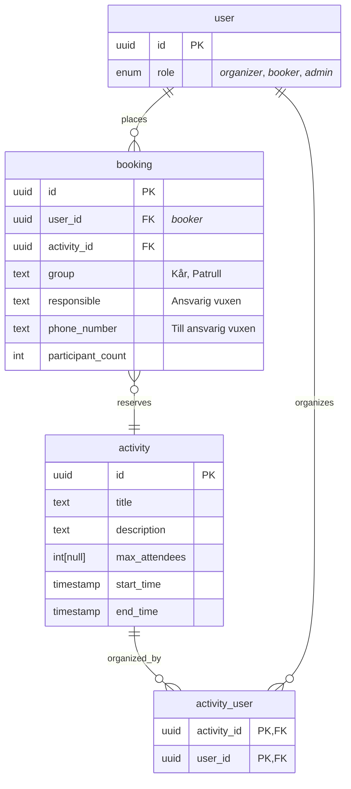
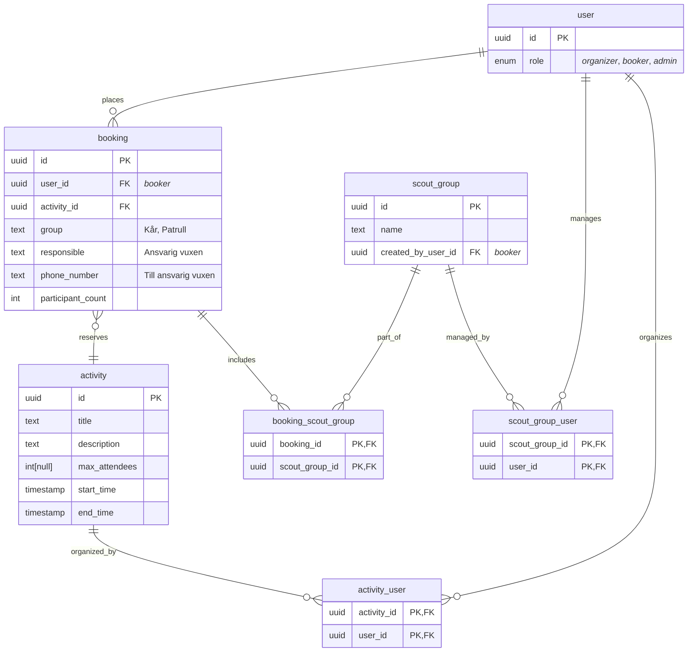

# Booking app for Jamboree26

This app will enable participant of Jamboree 2026 to book various activities.

## Tech stack

- Gleam
  - mist + wisp for web server
  - lustre + hx for templating and SSR
  - Squirrel for type safe DB interface
- HTMX
- TailwindCSS
- PostgreSQL

## Development

```sh
gleam run   # Run the project
gleam test  # Run the tests
```

## Database schema

### MVP



### Extra features


