# Booking app for Jamboree26

This app will enable participant of Jamboree 2026 to book various activities.

## Tech stack

- Gleam
  - mist + wisp for web server
  - lustre + hx for templating and SSR
  - Squirrel for type safe DB interface
  - Cigogne for database migrations
- HTMX
- TailwindCSS
- PostgreSQL

## Folder structure

| Path                                         | Purpose                                                      |
| -------------------------------------------- | ------------------------------------------------------------ |
| [`src/`](src/)                               | Gleam source code                                            |
| [`src/j26booking/`](src/j26booking/)         | Main app modules (components, data, router, sql, web, etc.)  |
| [`src/j26booking/sql/`](src/j26booking/sql/) | SQL queries for Squirrel                                     |
| [`priv/migrations/`](priv/migrations/)       | Database migration SQL files (applied with Cigogne)          |
| [`priv/seeding/`](priv/seeding/)             | SQL scripts for seeding the database with example data       |
| [`priv/static/`](priv/static/)               | Static files to be served by the web server (e.g. HTML, CSS) |
| [`test/`](test/)                             | Gleam test files                                             |

## Development

```sh
gleam run   # Run the project
gleam test  # Run the tests
```

## Database usage

This app requires you to have a postgreSQL database running locally if you want to run it.

### Gleam Squirrel

This project uses [Gleam Squirrel](https://hexdocs.pm/squirrel/index.html) for type-safe database access. Squirrel generates Gleam modules from your SQL schema and queries, allowing you to interact with PostgreSQL using Gleam types and functions.

**After changing or adding any SQL files** in [`src/j26booking/sql/`](src/j26booking/sql/), regenerate the Gleam modules by running:

```sh
gleam run -m squirrel
```

For usage details and examples, see the official Squirrel documentation: https://hexdocs.pm/squirrel/index.html

### Database configuration

The app for now uses a hardcoded default localhost PostgreSQL config. It requires your database to have the following connection config:

```
host=localhost
port=5432
user=postgres
password=
database=j26booking
```

### Running migrations with Gleam Cigogne

Database migrations are managed using [Gleam Cigogne](https://hexdocs.pm/cigogne/index.html).

You must set the `DATABASE_URL` environment variable with your database connection string before running migrations.

```sh
export DATABASE_URL="postgres://postgres@localhost:5432/j26booking"
gleam run -m cigogne last
```

This will apply all migrations in [`priv/migrations/`](priv/migrations/) to your database. Make sure your database is running and accessible with the config above.

### Seeding the database

To seed the database with example activities, you can run the SQL script in [`priv/seeding/activities.sql`](priv/seeding/activities.sql):

```sh
psql "$DATABASE_URL" -f priv/seeding/activities.sql
```

This will insert several sample activities into the `activity` table. Make sure your database is running and the schema is migrated before seeding.

### Database schema

#### MVP


#### Extra features

```mermaid
erDiagram

scout_group {
  uuid id PK
  text name
  uuid created_by_user_id FK "_booker_"
}

user {
  uuid id PK
  enum role "_organizer_, _booker_, _admin_"
}

activity {
  uuid id PK
  text title
  text description
  int[null] max_attendees
  timestamp start_time
  timestamp end_time
}

booking {
  uuid id PK
  uuid user_id FK "_booker_"
  uuid activity_id FK
  text group "Kår, Patrull"
  text responsible "Ansvarig vuxen"
  text phone_number "Till ansvarig vuxen"
  int participant_count
}

booking_scout_group {
  uuid booking_id PK,FK
  uuid scout_group_id PK,FK
}

scout_group_user {
  uuid scout_group_id PK,FK
  uuid user_id PK,FK
}

activity_user {
  uuid activity_id PK,FK
  uuid user_id PK,FK
}

booking ||--o{ booking_scout_group : includes
scout_group ||--o{ booking_scout_group : part_of

scout_group ||--o{ scout_group_user : managed_by
user ||--o{ scout_group_user : manages

activity ||--o{ activity_user : organized_by
user ||--o{ activity_user : organizes

booking }o--|| activity : reserves
user ||--o{ booking : places
```


