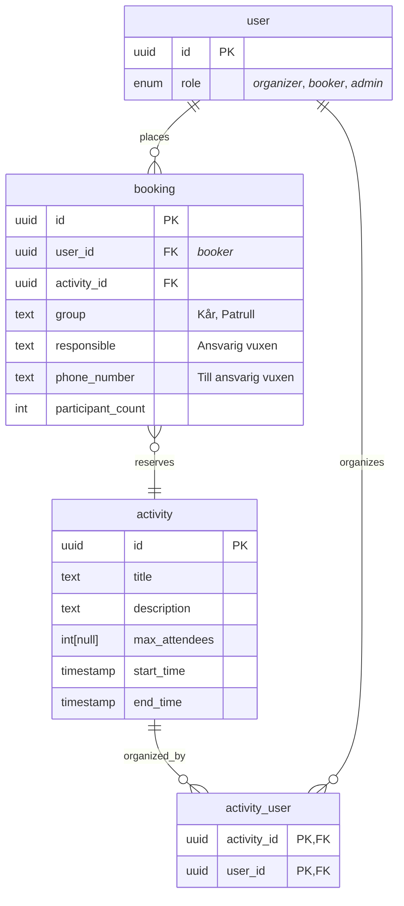
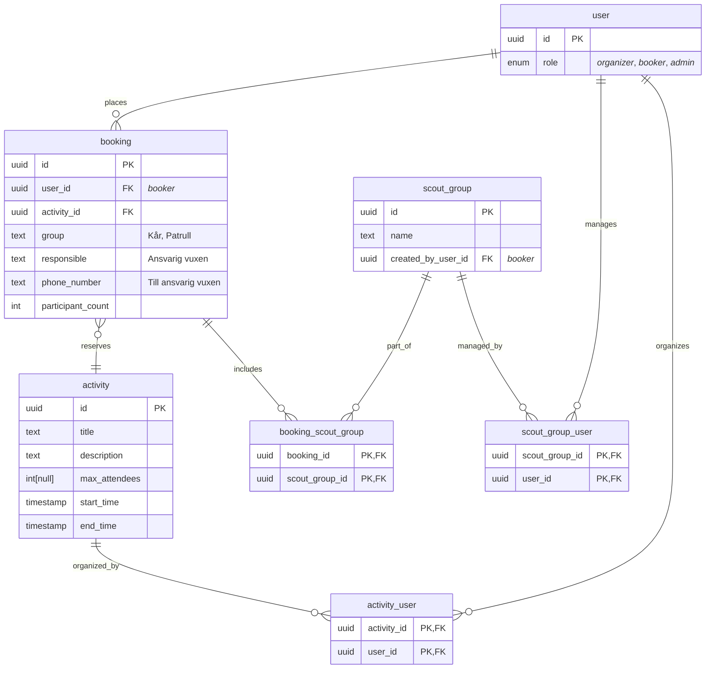

# J26 Booking Server

Backend server for the Jamboree 2026 booking application.

## Tech stack

- Gleam
  - mist + wisp for web server
  - lustre + hx for templating and SSR
  - Squirrel for type safe DB interface
  - Cigogne for database migrations
- HTMX
- TailwindCSS
- PostgreSQL

## Folder structure

| Path                                         | Purpose                                                      |
| -------------------------------------------- | ------------------------------------------------------------ |
| [`src/`](src/)                               | Gleam source code                                            |
| [`src/server/`](src/server/)                 | Main app modules (components, model, router, sql, web, etc.) |
| [`src/server/sql/`](src/server/sql/)         | SQL queries for Squirrel                                     |
| [`priv/migrations/`](priv/migrations/)       | Database migration SQL files (applied with Cigogne)          |
| [`priv/seeding/`](priv/seeding/)             | SQL scripts for seeding the database with example data       |
| [`priv/static/`](priv/static/)               | Static files to be served by the web server (e.g. HTML, CSS) |
| [`test/`](test/)                             | Gleam test files                                             |

## Development

### Local Development (without Docker)

```sh
gleam run   # Run the project
gleam test  # Run the tests
```

### Local Development (with Docker)

The easiest way to run the entire stack locally is using Docker Compose:

```sh
# Start all services (database + migrations + application)
docker-compose up

# Start in detached mode
docker-compose up -d

# View logs
docker-compose logs -f app

# Stop all services
docker-compose down

# Rebuild after code changes
docker-compose up --build
```

The application will be available at http://localhost:8000

**Note**: Database migrations run automatically when starting the stack. The app service waits for migrations to complete successfully before starting.

### Environment Variables

The application can be configured using the following environment variables:

| Variable          | Default                                       | Description                                      |
| ----------------- | --------------------------------------------- | ------------------------------------------------ |
| `PORT`            | 8000                                          | Port the web server listens on                   |
| `DATABASE_URL`    | postgres://postgres@localhost:5432/j26booking | PostgreSQL connection URL                        |
| `DB_POOL_SIZE`    | 15                                            | Connection pool size                             |
| `SECRET_KEY_BASE` | (random)                                      | Secret key for sessions (required in production) |
| `BASE_PATH`       | (empty string)                                | Base path prefix for all routes                  |

### Building Docker Image

To build the Docker image manually:

```sh
# Build the image
docker build -t j26booking:latest .

# Run the container
docker run -p 8000:8000 \
  -e DATABASE_URL=postgres://postgres@host.docker.internal:5432/j26booking \
  -e SECRET_KEY_BASE=your-secret-key \
  j26booking:latest
```

## Database usage

This app requires you to have a postgreSQL database running locally if you want to run it.

### Gleam Squirrel

This project uses [Gleam Squirrel](https://hexdocs.pm/squirrel/index.html) for type-safe database access. Squirrel generates Gleam modules from your SQL schema and queries, allowing you to interact with PostgreSQL using Gleam types and functions.

**After changing or adding any SQL files** in [`src/server/sql/`](src/server/sql/), regenerate the Gleam modules by running:

```sh
gleam run -m squirrel
```

For usage details and examples, see the official Squirrel documentation: https://hexdocs.pm/squirrel/index.html

### Database configuration

The app, migrations (Cigogne), and Squirrel all use the same `DATABASE_URL` environment variable format:

```sh
export DATABASE_URL="postgres://postgres@localhost:5432/j26booking"
```

If `DATABASE_URL` is not set, the app defaults to `postgres://postgres@localhost:5432/j26booking` for local development.

### Running migrations with Gleam Cigogne

Database migrations are managed using [Gleam Cigogne](https://hexdocs.pm/cigogne/index.html).

```sh
export DATABASE_URL="postgres://postgres@localhost:5432/j26booking"
gleam run -m cigogne all
```

This will apply all migrations in [`priv/migrations/`](priv/migrations/) to your database.

### Seeding the database

To seed the database with example activities, you can run the SQL script in [`priv/seeding/activities.sql`](priv/seeding/activities.sql):

```sh
psql "$DATABASE_URL" -f priv/seeding/activities.sql
```

This will insert several sample activities into the `activity` table. Make sure your database is running and the schema is migrated before seeding.

### Database schema

#### MVP



#### Extra features


