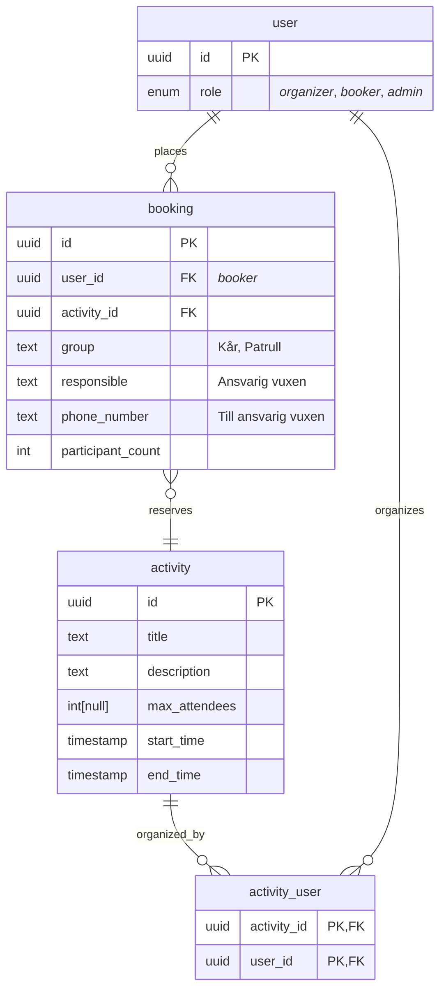
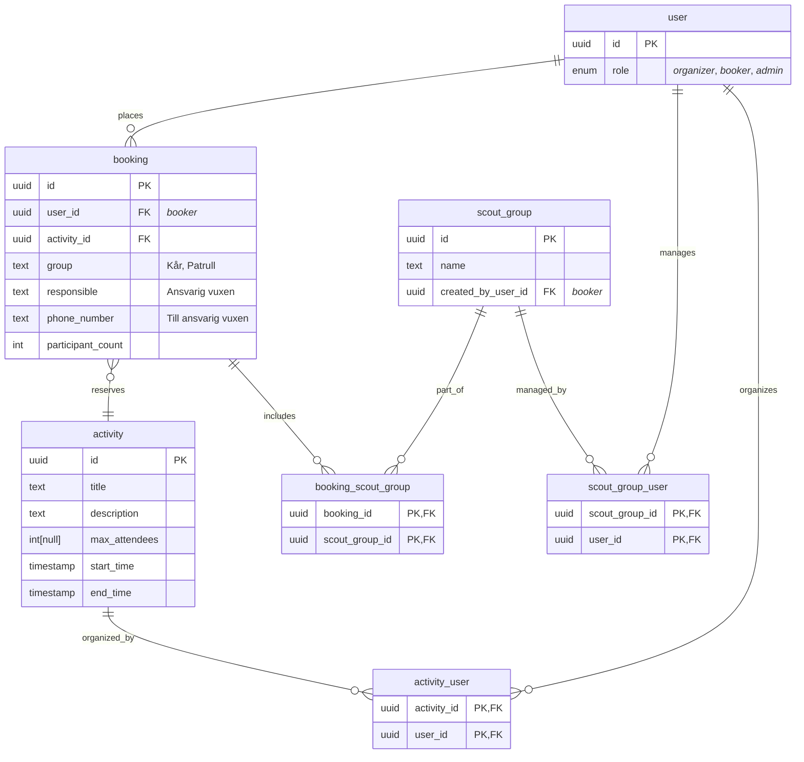

# J26 Booking Server

Backend server for the Jamboree 2026 booking application.

## Tech Stack

- Gleam (targeting Erlang)
  - Mist + Wisp for web server
  - Lustre for SSR and client-side SPA
  - Squirrel for type-safe DB queries
  - Cigogne for database migrations
- PostgreSQL

The compiled Lustre client app (`client.js`) is served from `priv/static/`.

## Folder Structure

| Path | Purpose |
| ---- | ------- |
| [`src/server.gleam`](src/server.gleam) | Entry point, supervision tree |
| [`src/server/`](src/server/) | Main app modules (router, web, components, model, etc.) |
| [`src/server/sql/`](src/server/sql/) | SQL query files for Squirrel |
| [`priv/migrations/`](priv/migrations/) | Database migration SQL files (applied with Cigogne) |
| [`priv/seeding/`](priv/seeding/) | SQL scripts for seeding the database with example data |
| [`priv/static/`](priv/static/) | Static files served by the web server (client.js, CSS, OpenAPI spec) |
| [`test/`](test/) | Gleam test files |

## Development

### Local Development (without Docker)

```sh
gleam run   # Run the project
gleam test  # Run the tests
```

### Local Development (with Docker)

The easiest way to run the entire stack locally is using Docker Compose:

```sh
# Start all services (database + migrations + application)
docker-compose up

# Start in detached mode
docker-compose up -d

# View logs
docker-compose logs -f app

# Stop all services
docker-compose down

# Rebuild after code changes
docker-compose up --build
```

The application will be available at http://localhost:8000

**Note**: Database migrations run automatically when starting the stack. The app service waits for migrations to complete successfully before starting.

### Environment Variables

| Variable | Default | Description |
| -------- | ------- | ----------- |
| `PORT` | 8000 | Port the web server listens on |
| `DATABASE_URL` | postgres://postgres@localhost:5432/j26booking | PostgreSQL connection URL |
| `DB_POOL_SIZE` | 15 | Connection pool size |
| `SECRET_KEY_BASE` | (random) | Secret key for sessions (required in production) |
| `BASE_PATH` | (empty string) | Base path prefix for all routes |
| `OPEN_ID_CONFIGURATION_URL` | https://app.dev.j26.se/auth/... | OpenID Connect discovery URL |

### Building Docker Image

To build the Docker image manually:

```sh
# Build the image
docker build -t j26booking:latest .

# Run the container
docker run -p 8000:8000 \
  -e DATABASE_URL=postgres://postgres@host.docker.internal:5432/j26booking \
  -e SECRET_KEY_BASE=your-secret-key \
  j26booking:latest
```

## Database

This app requires a PostgreSQL database.

### Squirrel

This project uses [Squirrel](https://hexdocs.pm/squirrel/index.html) for type-safe database access. Squirrel generates Gleam code from SQL query files.

**After changing or adding any SQL files** in [`src/server/sql/`](src/server/sql/), regenerate the Gleam modules by running:

```sh
gleam run -m squirrel
```

This updates `src/server/sql.gleam` — do not edit that file manually.

### Database Configuration

The app, migrations (Cigogne), and Squirrel all use the same `DATABASE_URL` environment variable:

```sh
export DATABASE_URL="postgres://postgres@localhost:5432/j26booking"
```

If not set, the app defaults to `postgres://postgres@localhost:5432/j26booking`.

### Running Migrations

Database migrations are managed using [Cigogne](https://hexdocs.pm/cigogne/index.html).

```sh
gleam run -m cigogne last
```

This applies all pending migrations from [`priv/migrations/`](priv/migrations/).

### Seeding the Database

```sh
psql "$DATABASE_URL" -f priv/seeding/activities.sql
```

This inserts sample activities into the `activity` table. Make sure migrations have been applied first.

### Database Schema

#### MVP


```mermaid
erDiagram

user {
  uuid id PK
  enum role "_organizer_, _booker_, _admin_"
}

activity {
  uuid id PK
  text title
  text description
  int[null] max_attendees
  timestamp start_time
  timestamp end_time
}

booking {
  uuid id PK
  uuid user_id FK "_booker_"
  uuid activity_id FK
  text group "Kår, Patrull"
  text responsible "Ansvarig vuxen"
  text phone_number "Till ansvarig vuxen"
  int participant_count
}

activity_user {
  uuid activity_id PK,FK
  uuid user_id PK,FK
}

activity ||--o{ activity_user : organized_by
user ||--o{ activity_user : organizes

booking }o--|| activity : reserves
user ||--o{ booking : places
```

#### Extra Features


```mermaid
erDiagram

scout_group {
  uuid id PK
  text name
  uuid created_by_user_id FK "_booker_"
}

user {
  uuid id PK
  enum role "_organizer_, _booker_, _admin_"
}

activity {
  uuid id PK
  text title
  text description
  int[null] max_attendees
  timestamp start_time
  timestamp end_time
}

booking {
  uuid id PK
  uuid user_id FK "_booker_"
  uuid activity_id FK
  text group "Kår, Patrull"
  text responsible "Ansvarig vuxen"
  text phone_number "Till ansvarig vuxen"
  int participant_count
}

booking_scout_group {
  uuid booking_id PK,FK
  uuid scout_group_id PK,FK
}

scout_group_user {
  uuid scout_group_id PK,FK
  uuid user_id PK,FK
}

activity_user {
  uuid activity_id PK,FK
  uuid user_id PK,FK
}

booking ||--o{ booking_scout_group : includes
scout_group ||--o{ booking_scout_group : part_of

scout_group ||--o{ scout_group_user : managed_by
user ||--o{ scout_group_user : manages

activity ||--o{ activity_user : organized_by
user ||--o{ activity_user : organizes

booking }o--|| activity : reserves
user ||--o{ booking : places
```
